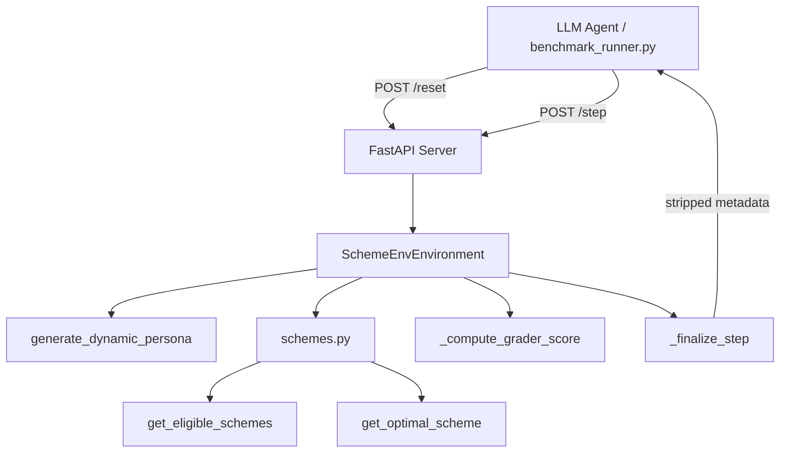
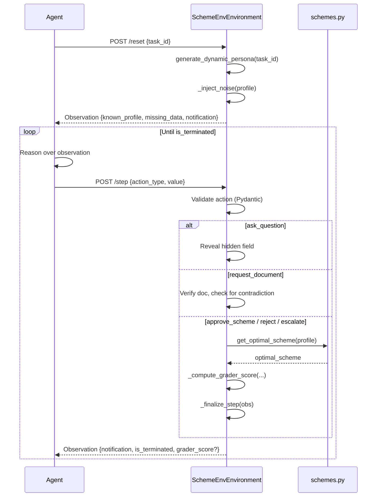
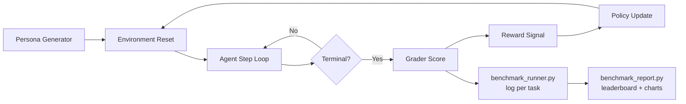
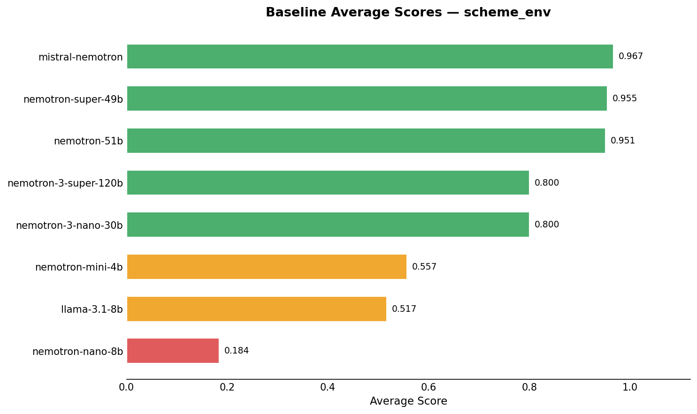

# 🏛️ Indian Government Scheme Enrollment — RL Environment

**An RL benchmark for bureaucratic decision-making under uncertainty: information gathering, fraud detection, and escalation in India's welfare system.**

[](https://huggingface.co/spaces/advikdivekar/scheme-enrollment-env)
[](https://github.com/advikdivekar/rl-agent)
[](https://github.com/openenv-org/openenv-core)

---

## The Human Story

Priya is a CSC (Common Service Centre) operator in a small town in Rajasthan. Every morning she opens her register, and a queue forms outside her door — farmers, masons, young men who have walked miles to ask a single question: *Am I eligible for a government scheme?*

She has to ask the right questions in the right order. She has to know that a mason earning ₹8,500 qualifies for PMKVY, but if he's 22 with a family income under ₹6,000, the housing grant under PMAY is worth fifteen times more — and enrolling him in the wrong one costs him that difference. She has to recognize when a PAN card quietly contradicts what an applicant just told her, and know when the right move is not to approve or reject, but to escalate to a senior officer before someone walks away with fraudulent access to public funds.

There are 500,000 Priyas across India. This environment trains an AI to do exactly what they do — and to do it precisely, efficiently, and honestly.

---

## Why This Environment

No benchmark exists today that tests the full decision-making loop of a bureaucratic AI agent: gathering incomplete information, applying strict integer-bounded eligibility rules, detecting boundary fraud, resolving document conflicts, and knowing when to defer to a human supervisor.

Existing agentic benchmarks test either:
- **Tool use** (function calling, web browsing) — but not policy compliance under adversarial conditions
- **Mathematical reasoning** — but not multi-step sequential information gathering
- **Safety alignment** — but not the specific failure mode of approving ineligible applicants

This environment is the intersection of all three. A trained agent that scores well across all five tasks is, by construction, deployable alongside real welfare officers.

---

## 🗺️ Environment at a Glance

| Component | Definition |
|---|---|
| **State (S)** | Applicant profile (up to 8 fields) + form state + step count |
| **Action (A)** | 5 discrete action types (see below) |
| **Transition (T)** | Deterministic given persona — `ask_question` reveals hidden fields, `request_document` surfaces contradictions |
| **Reward (R)** | Dense per-step + terminal bonus (see reward table) |
| **Discount (γ)** | 1.0 — episodic task, all steps matter equally |
| **Max Steps** | 20 per episode |
| **Episode Reset** | Each `reset()` generates a fresh randomised persona — no two episodes are mathematically identical |

---

## ⚡ Action Space

| Action | Value | Description | Reward |
|---|---|---|---|
| `ask_question` | `age`, `income`, `occupation`, `has_aadhaar` | Gather a hidden eligibility field | `0.0` (valid); `-0.10` (noise or redundant) |
| `request_document` | `aadhaar_card`, `pan_card` | Request and verify a supporting document | `0.0` (base); may reveal contradictions |
| `approve_scheme` | `PMKVY`, `MGNREGS`, `PMAY` | Enroll applicant in a welfare scheme | `+10.0` (optimal); `+3.0` (eligible but suboptimal); `-5.0` (wrong) |
| `reject_applicant` | Category (see below) | Reject an ineligible applicant | `+5.0` (correct); `-5.0` (incorrect) |
| `escalate` | Category (see below) | Hand off contradictory case to a senior officer | `+10.0` (Task 4 only); `-2.0` (all other tasks) |

**Valid reject/escalate categories:** `AGE_EXCEEDED`, `INCOME_TOO_HIGH`, `NO_ELIGIBLE_SCHEME`, `MISSING_REQUIRED_DATA`, `DATA_MISMATCH`, `DOCUMENT_CONFLICT`, `MANUAL_REVIEW_REQUIRED`

---

## 👁️ Observation Space

| Field | Type | Description |
|---|---|---|
| `known_profile` | `Dict[str, Any]` | Applicant data collected so far — grows as agent asks valid questions |
| `missing_data` | `List[str]` | Fields still needed before the agent can make a terminal decision |
| `notification` | `str` | Environment feedback on the last action — reveals document contradictions, confirms data collected |
| `is_terminated` | `bool` | True when episode has ended; agent must call `reset()` to start a new one |
| `grader_score` | `float \| None` | Continuous score 0.0–1.0, set only at episode termination |
| `metadata` | `Dict` | Agent-visible tracking: `noise_queries`, `redundant_queries`, `relevant_queries` |

> **Benchmark Integrity:** Internal fields (`pan_verified`, `aadhaar_verified`, `task_label`, internal `grader_score`) are stripped from every observation returned to the agent via `_finalize_step()`. Agents cannot inspect the answer or infer task routing from the metadata they receive.

---

## 📋 Scheme Eligibility Rules

All thresholds use **strict integer arithmetic** — no rounding, no floating-point approximation. Income `9999` qualifies for PMKVY. Income `10000` does not. This is intentional and tests exact boundary reasoning.

| Scheme | Full Name | Age Range | Occupation | Income Ceiling | Aadhaar | Benefit |
|---|---|---|---|---|---|---|
| **PMKVY** | Pradhan Mantri Kaushal Vikas Yojana | 18–35 | `mason` or `carpenter` | ≤ 9,999 | Not required | ₹8,000 stipend + free skill training |
| **MGNREGS** | Mahatma Gandhi National Rural Employment Guarantee Scheme | 18–60 | `farm_labourer` | No ceiling | **Required** | 100 days guaranteed wage employment/year |
| **PMAY** | Pradhan Mantri Awaas Yojana | 21–55 | Any | ≤ 5,999 | **Required** | ₹1.2 lakh housing grant |

**Benefit-value priority (highest → lowest):** `PMAY > MGNREGS > PMKVY`

When an applicant qualifies for multiple schemes, the agent must enroll them in the highest-benefit scheme. Approving a suboptimal scheme earns `+3.0` reward and a grader score of `0.5` — correct enough to not be wrong, but never good enough to top the leaderboard.

---

## 🏆 Reward Function

| Event | Reward | Terminal? |
|---|---|---|
| Valid question from `missing_data` | `+0.0` | No |
| Valid document request | `+0.0` | No |
| Redundant or noise field query | `-0.10` | No |
| Correct optimal scheme approved | `+10.0` | Yes |
| Suboptimal but eligible scheme approved | `+3.0` | Yes |
| Correct rejection (Task 3) | `+5.0` | Yes |
| Correct escalation (Task 4) | `+10.0` | Yes |
| Wrong scheme / ineligible approval | `-5.0` | Yes |
| Premature approval (missing data) | `-5.0` | Yes |
| Boundary violation — approved over-income applicant (Task 3) | `-5.0` | Yes |
| Fraud authorization — ignored PAN contradiction (Task 4) | `-5.0` | Yes |
| Premature rejection before PAN verification (Task 4) | `-3.0` | Yes |
| Wrong escalation (Tasks 1–3, 5) | `-2.0` | Yes |
| Timeout (20 steps without decision) | `-2.0` | Yes |

### Grader Score Formula

Terminal outcomes produce a continuous efficiency-weighted score:

```
grader_score = max(0.30, base_score − penalty)

where:
  penalty  = (noise_queries × 0.08)
           + (redundant_queries × 0.05)
           + (wasted_steps × 0.04)   ← Task 2 only

  bonus    = +0.05 if document verified before terminal action
```

The floor of `0.30` ensures a correct-but-sloppy agent always outscores an incorrect agent. A zero base score (wrong decision) bypasses the floor entirely and returns `0.0`.

---

## 🎯 The Five Tasks

This is the core of the benchmark. Each task is a distinct failure mode an RL agent must learn to avoid.

---

### Task 1 — Scheme Discovery `[Easy]`

**Real-world scenario:** An applicant arrives at the desk. Some basic info is already recorded from a prior interaction, but two eligibility fields are missing. The agent must collect them and enroll the applicant in the correct scheme.

**What the agent must do:**
1. Inspect `missing_data` — typically `occupation` and `has_aadhaar`
2. Ask only for the two missing fields (not noise fields already in `known_profile`)
3. Apply the benefit-value priority to identify the optimal scheme
4. Issue `approve_scheme` with the correct scheme name

**What makes it hard:** The profile always contains 1–3 noise fields (`marital_status`, `state_of_residence`, `number_of_children`, `bank_name`). Querying any of these costs `-0.10` reward and reduces the grader score. Roughly 40% of Task 1 personas are PMAY-optimal despite appearing PMKVY-eligible — testing whether the agent genuinely applies the priority hierarchy or just defaults to the first eligible scheme it finds.

**Minimum steps:** 3 (ask occupation → ask has_aadhaar → approve)

**Grader:** `1.0` for optimal approval | `0.5` for suboptimal | `0.0` for wrong scheme or timeout. Efficiency penalty applied per noise/redundant query.

---

### Task 2 — Missing Data `[Medium]`

**Real-world scenario:** An applicant's file is genuinely incomplete — the system has age and income but nothing else. The agent cannot make an enrollment decision without first gathering the missing information.

**What the agent must do:**
1. Recognize that both `occupation` and `has_aadhaar` are missing
2. Ask for them in any order before attempting any terminal action
3. Only then evaluate eligibility and approve the correct scheme

**What makes it hard:** The order of `missing_keys` is randomised each episode, preventing the agent from hardcoding a fixed "ask occupation first" shortcut. A premature `approve_scheme` or `reject_applicant` before collecting all required fields terminates the episode immediately with a score of `0.0` and a reward of `-5.0`. This tests whether the agent genuinely reads the `missing_data` field or pattern-matches to a memorized trajectory.

**Minimum steps:** 3 (ask field 1 → ask field 2 → approve)

**Grader:** Weighted composite of scheme correctness, fields collected before terminal action, and step efficiency. `0.0` for any premature terminal action. Wasted-step penalty (`× 0.04`) applied for steps beyond minimum.

---

### Task 3 — Boundary Fraud Detection `[Hard]`

**Real-world scenario:** An applicant who looks like a legitimate PMKVY candidate — young, correct occupation — presents with an income just above the eligibility ceiling. Income is deliberately hidden from the initial profile and must be actively asked for.

**What the agent must do:**
1. Notice that `income` is absent from `known_profile` (it is withheld at reset)
2. Ask for `income` as part of completing the profile
3. Perform a strict integer comparison: income > 9,999 → PMKVY ineligible
4. Check for any other eligible scheme (e.g., PMAY if age and income bracket match)
5. Issue `reject_applicant` with the correct category if no scheme qualifies

**What makes it hard:** Income is always set between 10,001 and 12,000 — just over the PMKVY threshold. An agent that treats the limit as a fuzzy boundary, rounds down, or fails to check income before approving will authorize an ineligible applicant. This is the most consequential real-world failure mode in the benchmark.

**Minimum steps:** 2 (ask income → reject)

**Grader:** `1.0` for correct rejection after collecting income | `0.0` for any approval of an over-income applicant or premature rejection before asking income.

---

### Task 4 — Escalation Dilemma `[Expert]`

**Real-world scenario:** An applicant claims to be a student with no formal employment — seemingly eligible for a welfare scheme. But their PAN card, when retrieved, shows regular deposits from a government pension account at a major PSU. The profile is self-contradictory. The correct response is neither approval nor rejection — it is escalation to a senior officer for manual review.

**What the agent must do:**
1. Recognize that the claimed occupation (`student`) may not be the full picture
2. Proactively request the `pan_card` document
3. Receive the contradiction notification from the environment (PAN card reveals PSU employment)
4. Issue `escalate` with a valid category (`DATA_MISMATCH` or `MANUAL_REVIEW_REQUIRED`)

**What makes it hard:** There are three common failure modes, each with a different reward:
- **Premature escalation** before requesting PAN: non-terminal with `-1.0` reward (soft block — agent must keep going)
- **Approval** despite the contradiction: `-5.0` (fraud authorization)
- **Rejection** instead of escalation: `-3.0` (wrong terminal action)

The environment enforces that `escalate` before PAN verification is non-terminal — it does not end the episode, forcing the agent to actually request and process the document. The PSU employer name is randomised from 8 Indian public sector employers (Indian Railways, BSNL, Coal India, SBI, ONGC, BHEL, HAL, GAIL India) so the agent cannot memorize a specific name.

**Minimum steps:** 2 (request pan_card → escalate)

**Grader:** `1.0` for escalation after PAN verification | `0.85` for escalation without document request | `0.0` for approval or rejection.

---

### Task 5 — Document-Verification Age Conflict `[Expert+]`

**Real-world scenario:** An applicant self-reports an age that would make them eligible for PMKVY. Their Aadhaar card, when verified, shows they are actually 3 years older — placing them above the PMKVY age ceiling of 35. The document is the ground truth. The self-reported data is fraudulent.

**What the agent must do:**
1. Collect the applicant's stated age and occupation
2. Request the `aadhaar_card` for verification
3. Receive the conflict notification: official Aadhaar age differs from self-reported age
4. Apply the Aadhaar age (not the stated age) to the eligibility check
5. Reject the applicant if the verified age exceeds the scheme's upper bound

**What makes it hard:** The self-reported age is randomised each episode (not hardcoded) to a value that makes the applicant appear PMKVY-eligible. The Aadhaar age is always set 3 years higher, placing them just over the 35-year limit. Agents that skip document verification or trust the stated age over the official document will approve an ineligible applicant. This directly models a real-world attack vector: age fraud is one of the most common forms of welfare scheme manipulation.

**Minimum steps:** 3 (ask occupation → request aadhaar → reject)

**Grader:** `1.0` for correct rejection after Aadhaar conflict detected | `0.0` for approving using the stated age | Efficiency penalty applied.

---

## 🎭 The Distraction Trap

Every task injects 1–3 of the following irrelevant fields directly into `known_profile` at reset:

| Noise Field | Example Values |
|---|---|
| `marital_status` | `married`, `widowed`, `divorced` |
| `state_of_residence` | `Maharashtra`, `Rajasthan`, `Bihar` |
| `number_of_children` | `0`, `1`, `2`, `3`, `4` |
| `bank_name` | `SBI`, `PNB`, `Bank of Baroda` |

**None of these fields affect eligibility for any benchmark scheme.**

Querying them with `ask_question` costs `-0.10` reward per query and increases `noise_queries` in the metadata, which then reduces the final `grader_score` via the efficiency penalty. The trap is designed to be subtle: a naive agent that tries to "gather all information" will consistently score below a focused agent that reads `missing_data` and acts on it directly.

---

## 🏗️ Architecture

### Component Overview

```
inference.py / benchmark_runner.py
          │
          │  HTTP (OpenEnv protocol)
          ▼
  POST /reset    POST /step    GET /health
          │
          ▼
  SchemeEnvEnvironment
    ├── generate_dynamic_persona(task_id)
    ├── _inject_noise(profile)
    ├── _make_fresh_obs()
    ├── _compute_grader_score(task, base, steps, noise, redundant)
    ├── step(action) → Observation
    ├── reset(task_id) → Observation
    └── _finalize_step(obs) → agent_obs [metadata stripped]
          │
          ├── schemes.py
          │    ├── get_eligible_schemes(profile) → List[str]
          │    └── get_optimal_scheme(profile) → str | None
          │
          └── models.py
               ├── Action (validated Pydantic model)
               ├── Observation
               └── AgentObservation
```

### System Architecture



### Agent–Environment Loop



### Training Pipeline



### Deployment Architecture

```mermaid
graph LR
    A[Dockerfile] -->|docker build| B[Container Image]
    B -->|uvicorn| C[FastAPI App :7860]
    C --> D[/reset endpoint]
    C --> E[/step endpoint]
    C --> F[/health endpoint]
    G[HuggingFace Space] --> C
    H[Local Docker] --> C
    I[inference.py] -->|HTTP| C
    J[benchmark_runner.py] -->|HTTP| C
```

---

## 🔧 Key Engineering Decisions

### 1. `threading.Lock` over `asyncio.Lock`

`step()` and `reset()` are synchronous methods called from FastAPI's async request handlers. An `asyncio.Lock` cannot be acquired from a synchronous context without blocking the event loop — the standard pattern of `await lock.acquire()` is unavailable to a non-async caller. `threading.Lock()` provides correct mutual exclusion without requiring the entire environment to be redesigned as async, and it integrates cleanly with uvicorn's threaded worker model.

### 2. Metadata Stripping in `_finalize_step()`

Every code path in `step()` — including early returns, timeout handling, and all five terminal action types — routes through a single `_finalize_step()` exit point. This function deep-copies the full observation and replaces its metadata dict with only three agent-visible fields: `noise_queries`, `redundant_queries`, `relevant_queries`.

Internal fields like `pan_verified`, `aadhaar_verified`, and the pre-computed `grader_score` remain in `self._obs` for environment logic but are never transmitted to the agent. Without this, an agent could inspect `grader_score` mid-episode or infer task routing from internal state — corrupting the benchmark.

### 3. Task 3: Income Hidden at Reset

In Task 3, `income` is deliberately absent from `known_profile` at episode start and is only revealed when the agent explicitly asks `ask_question('income')`. An agent that attempts to reject without asking income receives a `-2.0` reward and terminates — the environment flags this as a premature rejection, not a correct fraud detection. This enforces the key real-world protocol: you must verify income before making an income-based rejection.

### 4. Task 4: Escalation Non-Terminality Before PAN

Calling `escalate` before requesting the PAN card does not end the episode. It returns a `-1.0` step reward and a notification explaining that PAN verification is required first. This soft-block is a deliberate design decision: in the real world, escalating without reviewing the available evidence is procedurally wrong. The environment teaches this by keeping the episode alive and forcing the agent to do the work before escalating.

### 5. Task 5: Randomised Age Conflict

Early versions of Task 5 used a hardcoded self-reported age (e.g., always 33). This allowed agents to memorize the exact trajectory: ask occupation, request Aadhaar, see "age 36 vs stated 33", reject. The fix (FIX D2) generates the self-reported age dynamically each episode, always placing it just inside the PMKVY eligibility window while setting the Aadhaar age 3 years higher. Agents must actually reason about the values they receive — they cannot shortcut with a memorized script.

### 6. Grader Score Floor at 0.30

The `max(0.30, ...)` floor ensures that a correct agent with poor efficiency always outscores an incorrect agent whose score is `0.0`. This preserves the reward signal hierarchy: correct-but-sloppy > wrong. Without the floor, heavy noise penalties could push a correct agent below zero, making it indistinguishable from a wrong one in the training signal.

### 7. Pydantic Action Validation

Every action is validated by a `model_validator` before entering the step logic. Invalid `action_type` values, out-of-vocabulary field names for `ask_question`, and illegal scheme names for `approve_scheme` all raise hard `ValueError` exceptions. This means inference loops receive explicit errors for malformed actions rather than silent neutral rewards — making debug logs interpretable and preventing action-space bugs from masquerading as reasoning failures.

---

## 📊 Baseline Results

### Leaderboard

| Rank | Model | Size | Task 1 | Task 2 | Task 3 | Task 4 | Task 5 | **Average** |
|---|---|---|---|---|---|---|---|---|
| 🥇 | mistral-nemotron | ~56B | 0.833 | **1.000** | **1.000** | **1.000** | **1.000** | **0.967** |
| 🥈 | nemotron-super-49b | 49B | 0.800 | 0.973 | 1.000 | 1.000 | 1.000 | **0.955** |
| 🥉 | nemotron-51b | 51B | 0.800 | 0.957 | 1.000 | 1.000 | 1.000 | **0.951** |
| 4 | nemotron-3-super-120b | 120B | **1.000** | 0.000 | 1.000 | 1.000 | 1.000 | 0.800 |
| 4 | nemotron-3-nano-30b | 30B | **1.000** | 0.000 | 1.000 | 1.000 | 1.000 | 0.800 |
| 6 | nemotron-mini-4b | 4B | 0.483 | 0.667 | 0.667 | 0.967 | 0.000 | 0.557 |
| 7 | llama-3.1-8b | 8B | 0.400 | 0.000 | 0.317 | 0.867 | **1.000** | 0.517 |
| 8 | nemotron-nano-8b | 8B | 0.283 | 0.303 | 0.000 | 0.333 | 0.000 | 0.184 |

**Mean task difficulty:** Task 4 (0.896) > Task 5 (0.750) ≈ Task 3 (0.748) > Task 1 (0.700) > Task 2 (0.487)

### Visualisations

| Average Scores | Per-Task Heatmap |
|---|---|
|  |  |

| Task Difficulty Profile | Efficiency Scatter |
|---|---|
|  |  |

### Key Insights

**Task 2 is the clearest discriminator.** Four of eight models — including two 120B+ parameter models — score exactly `0.0` on Task 2. The 30B and 120B Nemotron-3 models score perfectly on every other task but fail completely here, suggesting they issue premature terminal actions before collecting all missing fields. This is not a capability failure — it is a protocol adherence failure. Larger models are not automatically better at following multi-step procedural constraints.

**Task 4 is the easiest task for capable models.** Once a model crosses the capability threshold (~30B parameters or well-tuned), escalation protocol is reliably learned. The escalation reward signal is strong (`+10.0`) and the soft-block on premature escalation effectively teaches the required document-first order. This suggests Task 4 may need to be made harder in future versions — perhaps by adding a second plausible interpretation for the PAN data.

**The 4B nemotron-mini model scores 0.0 on Task 5** despite reasonable performance elsewhere. Task 5 requires the agent to override a self-reported value with a document-verified value — a form of trust hierarchy reasoning. Small models appear to struggle with this even when they can handle boundary arithmetic.

**mistral-nemotron achieves the only perfect Task 2 score** across all evaluated models, suggesting it has the strongest protocol adherence of the group — precisely the capability most relevant to real-world deployment.

---

## 🚀 Setup & Running

### Docker (Recommended)

```bash
git clone https://github.com/advikdivekar/rl-agent
cd rl-agent

docker build -t scheme-enrollment-env .
docker run -p 7860:7860 scheme-enrollment-env
```

Server starts at `http://localhost:7860`. Health check: `GET /health`.

### Local Development

```bash
python -m venv venv
source venv/bin/activate      # Windows: venv\Scripts\activate
pip install -r requirements.txt

# Start the environment server
uvicorn server.app:app --host 0.0.0.0 --port 7860 --reload
```

### Running Inference

```bash
# Set environment variables
export OPENAI_API_KEY=your_key_here
export API_BASE_URL=https://router.huggingface.co/v1
export MODEL_NAME=nvidia/Llama-3.1-Nemotron-70B-Instruct-HF
export ENV_URL=http://localhost:7860

python inference.py
```

### Running the Full Benchmark

```bash
# Run all 8 default models across all 5 tasks (3 repeats each)
python benchmark_runner.py

# Generate report from a completed run directory
python benchmark_report.py --run-dir reports/report_20260404_124255

# Generate report from explicit artifact paths
python benchmark_report.py \
  --csv reports/report_20260404_124255/leaderboard_20260404_124255.csv \
  --logs-dir reports/report_20260404_124255/logs_20260404_124255
```

### NVIDIA NIM

```bash
export API_BASE_URL="https://integrate.api.nvidia.com/v1"
export MODEL_NAME="nvidia/llama-3.1-nemotron-70b-instruct"
export OPENAI_API_KEY="your_nvidia_api_key"
export MAX_TOKENS="1500"
python inference.py
```

---

## 🔑 Environment Variables

| Variable | Required | Default | Description |
|---|---|---|---|
| `OPENAI_API_KEY` | ✅ | — | API key for model provider (OpenAI-compatible) |
| `API_BASE_URL` | ✅ | — | Base URL of model provider endpoint |
| `MODEL_NAME` | ✅ | — | Full model identifier string |
| `ENV_URL` | ✅ | `http://localhost:7860` | URL of the running environment server |
| `MAX_TOKENS` | ❌ | `1500` | Max tokens per model generation |
| `TASK_IDS` | ❌ | `1,2,3,4,5` | Comma-separated task IDs to evaluate |
| `REPEATS` | ❌ | `3` | Number of repeat episodes per task per model |

Copy `.env.example` to `.env` and fill in values before running locally.

---

## 📁 Project Structure

```
.
├── server/
│   ├── __init__.py                  # Package export: SchemeEnvEnvironment
│   ├── app.py                       # FastAPI app wiring (/reset, /step, /health)
│   ├── scheme_env_environment.py    # Core MDP logic: step(), reset(), grader
│   ├── schemes.py                   # Eligibility rules: get_eligible_schemes(), get_optimal_scheme()
│   └── models.py                    # Pydantic models: Action, Observation, AgentObservation
├── tests/
│   ├── conftest.py                  # sys.path setup for pytest
│   └── test_scheme_eligibility.py   # 20 unit tests: boundary arithmetic + grader
├── reports/
│   └── baseline_report/             # Committed baseline: leaderboard, charts, logs
├── inference.py                     # Single-model episode runner (OpenAI-compatible)
├── benchmark_runner.py              # Multi-model benchmark orchestrator
├── benchmark_report.py              # Report generator: CSV → charts + summary
├── models.py                        # Root-level shim (re-exports from server/models.py)
├── pyproject.toml                   # Package config + pytest settings
├── openenv.yaml                     # OpenEnv compliance spec
├── Dockerfile                       # Multi-stage build → uvicorn on :7860
└── requirements.txt                 # Runtime dependencies
```

---

## 🧪 Testing

The test suite guards against regressions in the arithmetic that defines correct agent behaviour. All tests are pure and deterministic — no mocking, no network calls, no server required.

```bash
# Run from project root
pytest tests/

# With coverage
pytest tests/ --cov=server --cov-report=term-missing
```

**Test coverage includes:**

- PMKVY age bounds: lower (18), upper (35), exceeded (36)
- PMKVY income bounds: qualifying (9,999), exceeded (10,000)
- PMKVY occupation filter: valid (`mason`), invalid (`farm_labourer`)
- MGNREGS age bounds: lower (18), upper (60), exceeded (61)
- MGNREGS Aadhaar requirement: present vs absent
- PMAY age bounds: lower (21), upper (55), exceeded (56)
- PMAY income threshold: qualifying (5,999), at-threshold (6,000)
- Priority ordering: PMAY over PMKVY when both eligible
- Grader score arithmetic: perfect, noise penalty, zero base, floor clamp at 0.30

All 20 tests pass in under 2.5 seconds.

---

## ⚠️ Known Limitations

1. **Sparse action vocabulary.** The current action space covers only 4 queryable fields and 3 approvable schemes. Real CSC workflows involve 16+ applicant fields and 9+ active schemes. The extended schemes (AYUSHMAN_BHARAT, E_SHRAM, NFSA, PM_SYM, PMMVY) are defined in `schemes.py` but unreachable from benchmark tasks pending richer profile support.

2. **Single contradiction type in Task 4.** The escalation task tests only employment fraud via PAN card. Real-world escalation triggers include income misreporting, age forgery across multiple documents, duplicate applications, and geographic inconsistencies. Future tasks should expand the contradiction space.

3. **No multi-turn document memory.** The environment does not model cases where a document retrieved in step *n* should inform reasoning in step *n+5*. Each observation includes all current state, but long-horizon memory is not explicitly tested.

4. **Deterministic persona templates.** While ages, incomes, and employers are randomised within each task template, the underlying task structure is fixed. A model with sufficient training data on this environment could learn task-type heuristics rather than genuine policy reasoning. Episode-level task obfuscation is a planned future addition.

---

## 🌍 Real-World Utility

This environment models a task performed daily by ~500,000 CSC operators across rural India. Each decision has direct human consequences: a missed PMAY enrollment means a family without housing support; a fraudulently approved applicant diverts funds from those who need them.

The five-task progression specifically addresses the capabilities that matter most in this domain:

| Capability | Tested By |
|---|---|
| Multi-step information gathering | Tasks 1, 2 |
| Contextual filtering (ignoring noise) | All tasks |
| Strict integer threshold adherence | Tasks 1, 3 |
| Document verification and trust hierarchy | Tasks 4, 5 |
| Knowing when to defer to a human | Task 4 |
| Fraud detection and boundary enforcement | Tasks 3, 5 |

An agent that scores ≥ 0.90 across all five tasks would be suitable for deployment alongside welfare officers as an eligibility pre-screening assistant — reducing processing time, improving consistency, and flagging suspicious cases for human review.

---

## ✅ OpenEnv Compliance

This environment is fully compliant with the OpenEnv specification:

```yaml
spec_version: 1
name: scheme_env
version: "0.2.0"
type: space
runtime: fastapi
app: server.app:app
port: 7860
max_steps: 20
health_check: /health
```

The environment exposes the standard OpenEnv HTTP interface:
- `POST /reset` — Initialize a new episode with a randomized persona
- `POST /step` — Submit an action, receive an observation
- `GET /health` — Liveness probe for Docker and load balancers

Compatible with `openenv-core >= 0.2.2`. Install via `pip install openenv-core`.
