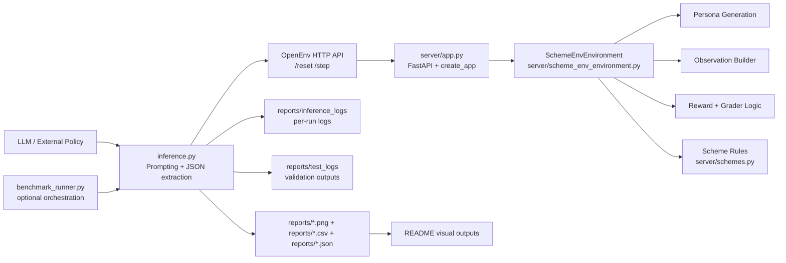
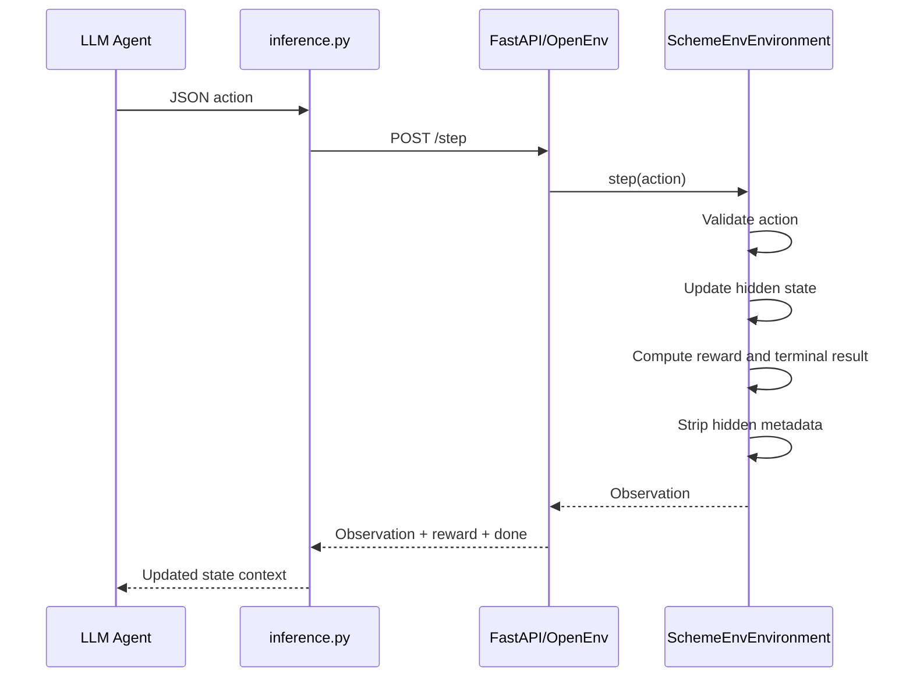
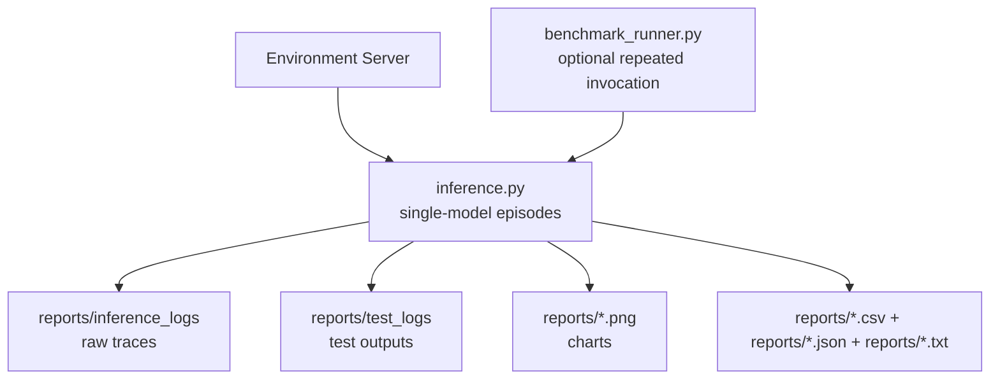
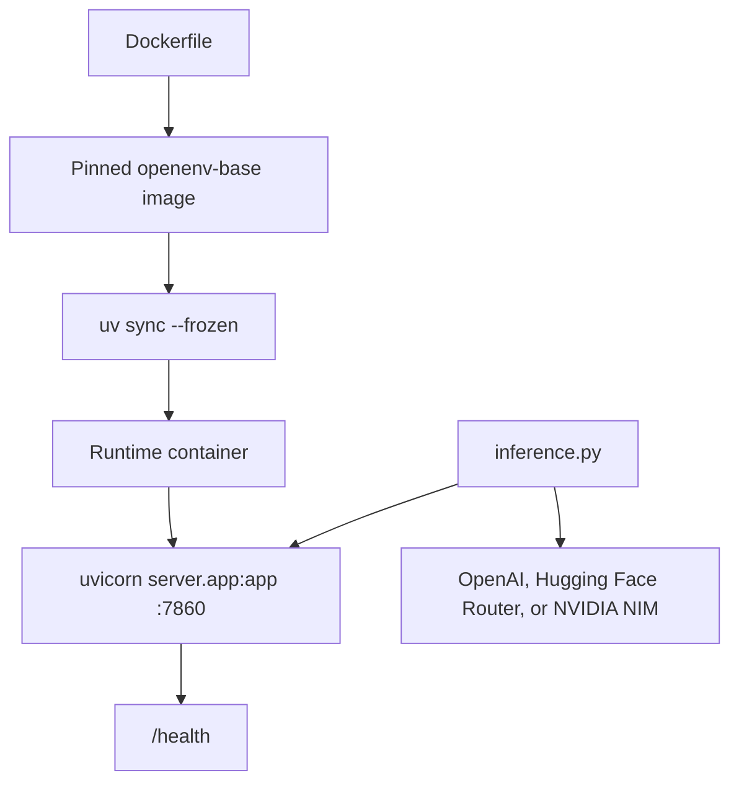
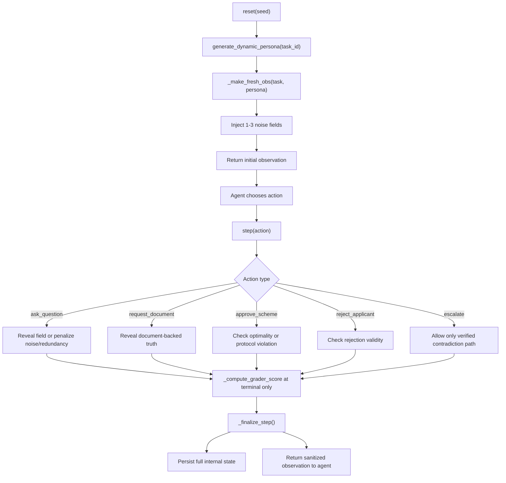
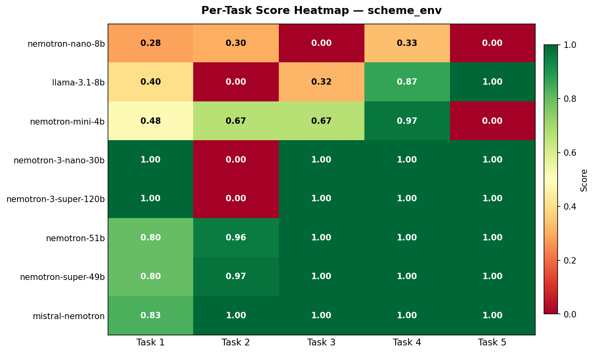
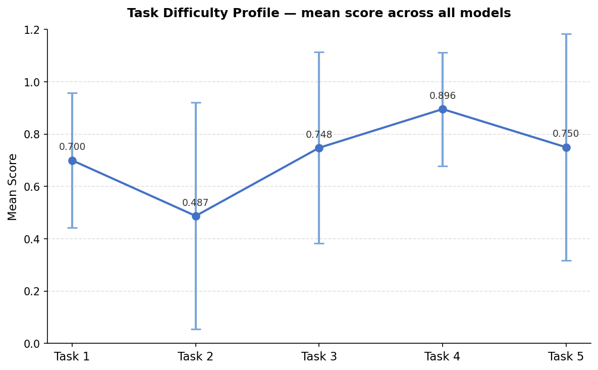
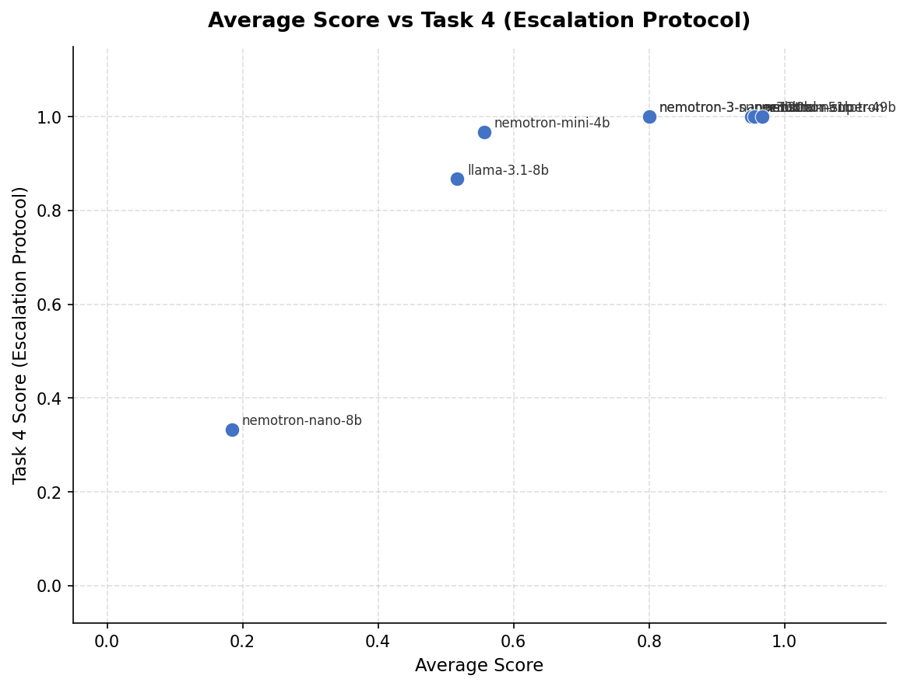

title: Scheme Enrollment Env
colorFrom: blue
colorTo: green
sdk: docker
pinned: false
app_port: 7860
tags:
  - openenv
  - reinforcement-learning
  - evaluation
  - agents
---

# Indian Government Scheme Enrollment — RL Environment

> *A reinforcement learning benchmark for bureaucratic reasoning: interviewing applicants, verifying documents, applying strict scheme rules, detecting fraud, and knowing when to escalate rather than decide.*

[](https://huggingface.co/spaces/advikdivekar/scheme-enrollment-env)
[](https://github.com/advikdivekar/rl-agent)
[](https://huggingface.co/openenv)
[](tests/)
[](#-the-5-tasks)

## The Case Study

Priya is a CSC operator in Barmer, Rajasthan. She interviews dozens of applicants every day across a wooden desk, a government-issue computer, and a slow internet connection. One afternoon, a young man walks in claiming to be a student. He wants to enroll in PMKVY, a skill-training scheme. On the surface, his profile looks plausible.

But something feels wrong. His income is unusually high for a student. Priya asks for his PAN card. It reveals six years of active pension-linked employment from a public sector company. He is not a student. He is attempting to claim a benefit under false pretenses.

Priya does not guess. She does not overreach. She escalates the case.

**This environment trains AI agents to behave like Priya.**

Not just to read a table of rules, but to:

- gather missing information before acting
- verify the right document at the right time
- apply exact arithmetic boundaries
- ignore irrelevant context
- distinguish ineligibility from contradiction
- escalate only when escalation is genuinely required

## Why This Environment Exists

Most RL and agent benchmarks focus on coding, games, search, or generic dialogue. Very few test policy compliance under partial observability, exact thresholds, and procedural safety.

This environment exists to measure a harder and more realistic capability cluster:

- **Policy compliance under uncertainty**: the agent must collect evidence before deciding
- **Fraud detection through document verification**: contradictions emerge only after the correct document is requested
- **Boundary arithmetic**: `9999` qualifies, `10000` does not
- **Escalation protocol**: the agent must know when not to decide
- **Noise filtering**: irrelevant profile fields appear alongside real signal

The benchmark is grounded in a workflow that affects welfare access, fraud prevention, and administrative fairness.

## Hackathon Compliance Snapshot

This repository is structured to satisfy the official Round 1 requirements:

- real-world task simulation, not a toy domain
- full OpenEnv environment with typed models, `step()`, `reset()`, `state()`, and `openenv.yaml`
- 5 graded tasks with deterministic programmatic scoring in the `0.0–1.0` range
- meaningful reward shaping over the trajectory
- root-level `inference.py` using the OpenAI client
- Dockerfile plus Hugging Face Space deployment metadata
- pre-submission validation via `scripts/pre-validation-script.sh`
- README coverage for environment description, action space, observation space, tasks, setup, and baseline scores

## Table of Contents

- [Environment at a Glance](#environment-at-a-glance)
- [Repository Structure](#repository-structure)
- [Architecture Overview](#architecture-overview)
- [System Architecture](#system-architecture)
- [Agent-Environment Architecture](#agent-environment-architecture)
- [Training Pipeline Architecture](#training-pipeline-architecture)
- [Reward Architecture](#reward-architecture)
- [Deployment and Inference Architecture](#deployment-and-inference-architecture)
- [Data Flow Architecture](#data-flow-architecture)
- [Environment Contract](#environment-contract)
- [Action Space](#action-space)
- [Observation Space](#observation-space)
- [Scheme Eligibility Rules](#scheme-eligibility-rules)
- [The 5 Tasks](#the-5-tasks)
- [The Distraction Trap](#the-distraction-trap)
- [Benchmark Outputs and Screenshots](#benchmark-outputs-and-screenshots)
- [Baseline Results](#baseline-results)
- [Setup and Running](#setup-and-running)
- [Environment Variables](#environment-variables)
- [Testing](#testing)
- [Pre-Submission Validation](#pre-submission-validation)
- [OpenEnv Compliance](#openenv-compliance)

## Environment at a Glance

| Component | Definition |
|---|---|
| **State (S)** | Applicant profile, partial observation state, hidden persona fields, step count |
| **Action (A)** | `ask_question`, `request_document`, `approve_scheme`, `reject_applicant`, `escalate` |
| **Transition (T)** | Deterministic given persona and task template |
| **Reward (R)** | Intermediate shaping plus terminal outcome rewards |
| **Horizon** | 20 steps per episode |
| **Grader** | Terminal normalized score `0.0` to `1.0` |
| **Server** | FastAPI via OpenEnv `create_app` |
| **Inference** | OpenAI-compatible client, provider-agnostic |
| **Benchmarking** | Inference-first evaluation flow with optional multi-model orchestration |

## Repository Structure

```text
.
├── README.md
├── pyproject.toml
├── requirements.txt
├── uv.lock
├── Dockerfile
├── openenv.yaml
├── .env.example
├── models.py
├── client.py
├── inference.py
├── benchmark_runner.py
├── benchmark_report.py
├── server/
│   ├── __init__.py
│   ├── app.py
│   ├── models.py
│   ├── scheme_env_environment.py
│   └── schemes.py
├── tests/
│   ├── conftest.py
│   └── test_scheme_eligibility.py
└── reports/
    ├── average_scores.png
    ├── task_heatmap.png
    ├── difficulty_profile.png
    ├── efficiency_scatter.png
    ├── inference_logs/
    └── test_logs/
```

### What each major file does

- [server/app.py](server/app.py): FastAPI/OpenEnv server entrypoint exposing `/reset`, `/step`, and `/health`
- [server/scheme_env_environment.py](server/scheme_env_environment.py): environment lifecycle, task logic, reward shaping, step transitions, shared state, metadata sanitization
- [server/schemes.py](server/schemes.py): scheme metadata, eligibility logic, optimal scheme selection
- [models.py](models.py): root `Action` and `Observation` schemas used by inference and server logic
- [client.py](client.py): OpenEnv client wrapper for typed environment access
- [inference.py](inference.py): single-model evaluation loop that produces the primary output bundle under `reports/`
- [benchmark_runner.py](benchmark_runner.py): optional multi-model orchestration layer
- [benchmark_report.py](benchmark_report.py): report and chart generation from benchmark artifacts
- [tests/test_scheme_eligibility.py](tests/test_scheme_eligibility.py): boundary-condition and grading tests
- [reports](reports): benchmark outputs, summary files, charts, and archived logs

## Architecture Overview

This repo has a clean separation between:

1. the **environment runtime**
2. the **model interaction loop**
3. the **benchmark orchestration layer**
4. the **reporting and visualization layer**

## System Architecture



### Runtime layers

- **Inference layer**: talks to external models and formats actions
- **API layer**: standard OpenEnv-compatible transport over HTTP
- **Environment layer**: task logic, hidden persona state, reward logic
- **Data layer**: scheme rules and typed schemas
- **Reporting layer**: benchmark aggregation and visualization

## Agent-Environment Architecture



### Core interaction pattern

- the agent never mutates internal state directly
- every step is mediated through a strict typed action schema
- the environment can soft-block some wrong protocol steps and allow recovery
- the final score depends on both correctness and efficiency

## Training Pipeline Architecture

This repository is an **evaluation and benchmarking pipeline**, not an on-policy RL training loop with replay buffers and optimizer steps. Still, there is a clear training-style pipeline structure:



### What this pipeline enables

- repeated evaluation over randomized personas
- capability comparison across model sizes and families
- exploit detection through artifact inspection
- persistent inference logs and validation outputs inside `reports/`

## Reward Architecture

The reward system has three layers:

1. **intermediate shaping**
2. **terminal outcome reward**
3. **continuous grader score**

### Intermediate shaping

| Event | Reward |
|---|---|
| Valid `ask_question` | `0.0` |
| Valid `request_document` | `0.0` |
| Noise query | `-0.10` |
| Redundant query | `-0.10` |
| Soft-block protocol violation | `-1.0` to `-1.5` depending on task/context |

### Terminal outcomes

| Event | Reward |
|---|---|
| Correct optimal approval | `+10.0` |
| Correct escalation | `+10.0` |
| Correct rejection | `+5.0` |
| Suboptimal but eligible approval | `+3.0` |
| Wrong escalation | `-2.0` |
| Wrong rejection | `-5.0` |
| Ineligible approval | `-5.0` |
| Premature approval | `-5.0` |
| Timeout | `-2.0` |

### Continuous grader

```text
grader_score = max(0.30, min(1.0, base_score - penalty + bonus))
```

Where:

```text
penalty =
  (noise_queries * 0.08) +
  (redundant_queries * 0.05) +
  (wasted_steps * 0.04)   # Task 2 only

bonus =
  0.05 if document_verified else 0.0
```

### Why this design is strong

- correct but sloppy agents still outrank wrong agents
- agents cannot farm intermediate reward
- document protocol adherence is rewarded
- score remains leaderboard-friendly

## Deployment and Inference Architecture



### Deployment characteristics

- Dockerfile uses a multi-stage build
- base image is sha256-pinned
- `uv.lock` is used for reproducible dependency resolution
- server runs with `uvicorn server.app:app`
- health checks hit `/health`

### Inference characteristics

- all LLM calls use the OpenAI Python client
- the client is configured from environment variables in `inference.py`
- structured stdout logs follow `[START]`, `[STEP]`, and `[END]`
- provider normalization remains in place for compatible endpoints

## Data Flow Architecture



### Important data flow properties

- hidden persona flags never go directly to the model
- internal metadata is stripped before return
- timeout enforcement happens centrally in `_finalize_step()`
- all step paths converge through the same finalization logic

## Environment Contract

The environment follows the OpenEnv contract with:

- `POST /reset`
- `POST /step`
- `GET /health`

[openenv.yaml](openenv.yaml) currently specifies:

- `name: scheme_env`
- `version: 0.2.0`
- `runtime: fastapi`
- `app: server.app:app`
- `port: 7860`
- `max_steps: 20`

## Action Space

| Action | Valid Values | Description | Reward |
|---|---|---|---|
| `ask_question` | `age`, `income`, `occupation`, `has_aadhaar` | Request a specific eligibility field | `0.0` valid, `-0.10` redundant/noise |
| `request_document` | `aadhaar_card`, `pan_card`, `aadhaar`, `pan` | Request an official verification document | `0.0` valid, reveals hidden truth |
| `approve_scheme` | `PMKVY`, `MGNREGS`, `PMAY` | Enroll the applicant in a scheme | `+10.0`, `+3.0`, or `-5.0` |
| `reject_applicant` | `AGE_EXCEEDED`, `INCOME_TOO_HIGH`, `NO_ELIGIBLE_SCHEME`, `MISSING_REQUIRED_DATA`, `DATA_MISMATCH`, `DOCUMENT_CONFLICT` | Reject with a concise reason code | `+5.0` or `-5.0` |
| `escalate` | `DATA_MISMATCH`, `MANUAL_REVIEW_REQUIRED`, or empty | Escalate to a senior officer | correct only in contradiction path |

The action space is intentionally small, real-world, and exploit-resistant.

## Observation Space

Each step returns a structured observation:

| Field | Type | Description |
|---|---|---|
| `known_profile` | `Dict[str, Any]` | Applicant data collected so far |
| `missing_data` | `List[str]` | Fields still required before a valid terminal decision |
| `notification` | `str` | Natural-language feedback from the environment |
| `is_terminated` | `bool` | Episode has ended |
| `grader_score` | `Optional[float]` | Terminal normalized score |
| `metadata` | `Dict[str, Any]` | Agent-visible counters only |

### Metadata exposure policy

The agent sees only:

- `noise_queries`
- `redundant_queries`
- `relevant_queries`

Internal fields such as `pan_verified`, `aadhaar_verified`, and hidden task markers are stripped before transmission.

## Scheme Eligibility Rules

All comparisons use strict integer arithmetic.

| Scheme | Full Name | Age Range | Occupation | Income Ceiling | Aadhaar | Benefit |
|---|---|---|---|---|---|---|
| **PMKVY** | Pradhan Mantri Kaushal Vikas Yojana | 18 to 35 | `mason` or `carpenter` | `<= 9999` | Not required | Rs 8,000 training stipend |
| **MGNREGS** | Mahatma Gandhi National Rural Employment Guarantee Scheme | 18 to 60 | `farm_labourer` only | None | Required | 100 days wage employment |
| **PMAY** | Pradhan Mantri Awaas Yojana | 21 to 55 | Any | `<= 5999` | Required | Rs 1.2 lakh housing grant |

### Priority rule

When multiple schemes are eligible:

```text
PMAY > MGNREGS > PMKVY
```

The repo also defines future-facing extended schemes in [server/schemes.py](server/schemes.py), but current benchmark tasks are built around the core three.

## The 5 Tasks

### Task 1 — Scheme Discovery

The agent starts with a partially hidden profile and must collect the remaining eligibility fields before approving the **optimal** scheme, not merely an eligible one.

| Parameter | Value |
|---|---|
| Profile at reset | `age` and `income` visible, `occupation` and `has_aadhaar` hidden |
| Persona range | age 18 to 35, income 1,000 to 9,999 |
| Minimum steps | 3 |
| Core skill | benefit-aware scheme ranking |

### Task 2 — Missing Data

The applicant file is incomplete. The agent must collect all required fields before making any terminal decision.

| Parameter | Value |
|---|---|
| Profile at reset | age + income visible, randomized missing field order |
| Optimal scheme | MGNREGS once fields are collected |
| Minimum steps | 3 |
| Core skill | procedural completeness |

### Task 3 — Boundary Fraud Detection

Income is hidden initially. Once revealed, it always exceeds the PMKVY threshold, and the correct action is rejection.

| Parameter | Value |
|---|---|
| Profile at reset | age visible, income hidden |
| Income range | 10,001 to 12,000 |
| Minimum steps | 4 |
| Core skill | exact arithmetic boundary reasoning |

### Task 4 — Escalation Dilemma

The applicant claims to be a student, but PAN verification reveals long-term public-sector employment. The correct response is escalation after verification.

| Parameter | Value |
|---|---|
| Profile at reset | complete profile, occupation=`student` |
| Income range | 8,000 to 20,000 |
| Minimum steps | 2 |
| Core skill | contradiction handling and escalation |

### Task 5 — Document Conflict

The self-reported age looks near the PMKVY boundary, but Aadhaar reveals a disqualifying official age. The correct response is verified rejection.

| Parameter | Value |
|---|---|
| Self-reported age | 33, 34, or 35 |
| Aadhaar age | always greater than 35 |
| Income range | 6,001 to 9,000 |
| Minimum steps | 2 |
| Core skill | document authority over self-report |

## The Distraction Trap

Every episode injects 1 to 3 irrelevant fields into `known_profile`, for example:

- `marital_status`
- `state_of_residence`
- `number_of_children`
- `bank_name`

These look plausibly administrative, but they do **not** affect eligibility. Querying them incurs penalties and lowers the grader score.

This is a deliberate benchmark feature, not cosmetic clutter.

## Benchmark Outputs and Screenshots

The evaluation flow centers on `inference.py`. The run outputs shown here are written under `reports/`, with the most important raw output directories being:

- `reports/inference_logs/`
- `reports/test_logs/`

The top-level `reports/` directory also holds the rendered charts and summary files generated from the same inference-driven run bundle.

### Generated artifact bundle

```text
reports/
├── average_scores.png
├── task_heatmap.png
├── difficulty_profile.png
├── efficiency_scatter.png
├── leaderboard.csv
├── results.json
├── summary.txt
├── README.txt
├── inference_logs/
└── test_logs/
```

These artifacts represent the output bundle produced by the inference flow. The raw per-model traces live in `reports/inference_logs/`, and the verification outputs live in `reports/test_logs/`.

### 1. Leaderboard output

The top-level CSV output from the sample run is:

| Model | Size | Task1 | Task2 | Task3 | Task4 | Task5 | Average |
|---|---|---:|---:|---:|---:|---:|---:|
| mistralai/mistral-nemotron | ~56B | 0.833 | 1.000 | 1.000 | 1.000 | 1.000 | **0.967** |
| nvidia/llama-3.3-nemotron-super-49b-v1 | 49B | 0.800 | 0.973 | 1.000 | 1.000 | 1.000 | 0.955 |
| nvidia/llama-3.1-nemotron-51b-instruct | 51B | 0.800 | 0.957 | 1.000 | 1.000 | 1.000 | 0.951 |
| nvidia/nemotron-3-nano-30b-a3b | 30B | 1.000 | 0.000 | 1.000 | 1.000 | 1.000 | 0.800 |
| nvidia/nemotron-3-super-120b-a12b | 120B | 1.000 | 0.000 | 1.000 | 1.000 | 1.000 | 0.800 |
| nvidia/nemotron-mini-4b-instruct | 4B | 0.483 | 0.667 | 0.667 | 0.967 | 0.000 | 0.557 |
| meta/llama-3.1-8b-instruct | 8B | 0.400 | 0.000 | 0.317 | 0.867 | 1.000 | 0.517 |
| nvidia/llama-3.1-nemotron-nano-8b-v1 | 8B | 0.283 | 0.303 | 0.000 | 0.333 | 0.000 | 0.184 |

### 2. Summary output

The sample summary file reports:

```text
OpenEnv scheme_env Benchmark — Baseline Report Summary
========================================================
Date generated      : 2026-04-08
Models evaluated    : 8

Best model          : mistral-nemotron (avg=0.967)
Worst model         : nemotron-nano-8b (avg=0.184)

Hardest task        : Task 2 (mean=0.487)
Easiest task        : Task 4 (mean=0.896)

Perfect score (1.0 on all tasks): none
```

### 3. Average score chart


This chart gives the fastest overall leaderboard comparison across models.

### 4. Per-task heatmap



This chart is especially useful for spotting capability cliffs and task-specific failure modes.

### 5. Difficulty profile



This chart summarizes which tasks are easiest or hardest across the evaluated model set.

### 6. Efficiency / protocol-view scatter



This chart helps interpret whether strong models are also protocol-efficient, not just ultimately correct.

### 7. Raw artifacts included in the bundle

The generated output bundle also includes:

- `results.json`
- `leaderboard.csv`
- `summary.txt`
- `README.txt`
- `inference_logs/`
- `test_logs/`

That means the README now shows not just plots, but also the exact machine-readable outputs and raw logs the benchmark produces.

## Baseline Results

Across the included baseline report:

- **best model**: `mistralai/mistral-nemotron` at `0.967`
- **worst model**: `nvidia/llama-3.1-nemotron-nano-8b-v1` at `0.184`
- **hardest task**: Task 2
- **easiest task**: Task 4

### What these results reveal

- **Task 2 is a strong discriminator**: some larger models still fail to commit to the final approval even after collecting the needed fields
- **Task 5 separates small models sharply**: some understand the contradiction but fail to translate it into a valid schema action
- **Task 4 is protocol-heavy, not purely reasoning-heavy**: once the contradiction is document-backed, many models can resolve it correctly
- **Task 1 remains nontrivial**: choosing the optimal scheme instead of the first eligible scheme still trips strong models

## Setup and Running

### Option 1 — Docker

```bash
docker build -t scheme-enrollment-env .
docker run -p 7860:7860 scheme-enrollment-env
curl http://localhost:7860/health
```

### Option 2 — Local

```bash
git clone https://github.com/advikdivekar/rl-agent.git
cd rl-agent
python -m venv .venv
source .venv/bin/activate
pip install -r requirements.txt
export PYTHONPATH=.
uvicorn server.app:app --host 0.0.0.0 --port 7860
```

### With `uv`

```bash
uv sync
export PYTHONPATH=.
uvicorn server.app:app --host 0.0.0.0 --port 7860
```

### Running inference

Hugging Face Router:

```bash
export HF_TOKEN=your_hf_token
export API_BASE_URL=https://router.huggingface.co/v1
export MODEL_NAME=Qwen/Qwen2.5-7B-Instruct
export ENV_URL=http://localhost:7860
export N_REPEATS=3
python inference.py
```

OpenAI-compatible endpoint:

```bash
export HF_TOKEN=your_api_token
export API_BASE_URL=https://api.openai.com/v1
export MODEL_NAME=gpt-4.1-mini
export ENV_URL=http://localhost:7860
python inference.py
```

## Environment Variables

| Variable | Default | Description |
|---|---|---|
| `HF_TOKEN` | unset | Token used by the OpenAI client for authenticated calls |
| `API_BASE_URL` | `https://router.huggingface.co/v1` | Model endpoint |
| `MODEL_NAME` | `Qwen/Qwen2.5-7B-Instruct` | Model identifier |
| `LOCAL_IMAGE_NAME` | unset | Optional local image name when using `from_docker_image()` workflows |
| `ENV_URL` | `http://localhost:7860` | Environment server URL |
| `MAX_TOKENS` | `1500` | Max tokens per model call |
| `N_REPEATS` | `3` | Episodes per task |
| `INFERENCE_TEMPERATURE` | `0.0` | Sampling temperature |

`inference.py` now reads:

```python
API_BASE_URL = os.getenv("API_BASE_URL", "https://router.huggingface.co/v1")
MODEL_NAME = os.getenv("MODEL_NAME", "Qwen/Qwen2.5-7B-Instruct")
HF_TOKEN = os.getenv("HF_TOKEN")
LOCAL_IMAGE_NAME = os.getenv("LOCAL_IMAGE_NAME")
```

and all LLM calls are made through:

```python
from openai import OpenAI
client = OpenAI(base_url=API_BASE_URL, api_key=HF_TOKEN)
```

## Testing

Run the unit tests with:

```bash
export PYTHONPATH=.
pytest tests/ -v
```

Current unit tests cover:

- PMKVY age and income boundaries
- PMAY strict ceiling behavior
- MGNREGS Aadhaar requirement
- optimal-scheme priority ordering
- grader score floor and penalty math

When benchmark verification outputs are generated, they are written under `reports/test_logs/`.

## Pre-Submission Validation

To make hackathon submission checks repeatable, the repo includes a dedicated pre-validation script:

```bash
./scripts/pre-validation-script.sh <ping_url> [repo_dir]
```

Example:

```bash
cd /tmp/rl-agent-readme-pr
./scripts/pre-validation-script.sh https://advikdivekar-scheme-enrollment-env.hf.space /tmp/rl-agent-readme-pr
```

### What the script checks

- repository structure and required files
- `inference.py` environment-variable contract
- OpenAI client usage and structured `[START]`, `[STEP]`, `[END]` logs
- OpenEnv surface requirements from `openenv.yaml`
- README coverage for action space, observation space, setup, tasks, and baseline outputs
- live Hugging Face Space `/reset` and `/health`
- Docker build success
- `openenv validate`
- Python compile sanity
- `pytest tests/`

### Passing validation output

```text
========================================
  OpenEnv Submission Validator
========================================
[16:37:15] Repo:     /tmp/rl-agent-readme-pr
[16:37:15] Ping URL: https://advikdivekar-scheme-enrollment-env.hf.space

[16:37:15] Step 1/8: Repo structure checks ...
[16:37:15] PASSED -- README present: README.md
[16:37:15] PASSED -- Root inference script present: inference.py
[16:37:15] PASSED -- openenv.yaml present: openenv.yaml
[16:37:15] PASSED -- Dockerfile present: Dockerfile
[16:37:15] PASSED -- Root models.py present: models.py
[16:37:15] PASSED -- server package present: server
[16:37:15] PASSED -- tests directory present: tests
[16:37:15] Step 2/8: Inference contract checks ...
[16:37:15] PASSED -- OpenAI client imported in inference.py
[16:37:15] PASSED -- API_BASE_URL read from env with default
[16:37:15] PASSED -- MODEL_NAME read from env with default
[16:37:15] PASSED -- HF_TOKEN read from env without default
[16:37:15] PASSED -- LOCAL_IMAGE_NAME optionally supported
[16:37:15] PASSED -- OpenAI client configured from required env vars
[16:37:15] PASSED -- Structured START log marker present
[16:37:15] PASSED -- Structured STEP log marker present
[16:37:15] PASSED -- Structured END log marker present
[16:37:15] Step 3/8: OpenEnv spec surface checks ...
[16:37:15] PASSED -- openenv.yaml declares spec_version
[16:37:15] PASSED -- openenv.yaml declares runtime
[16:37:15] PASSED -- openenv.yaml declares app entrypoint
[16:37:15] PASSED -- openenv.yaml declares port
[16:37:15] PASSED -- Environment defines reset()
[16:37:15] PASSED -- Environment defines step()
[16:37:15] PASSED -- Environment exposes state property/method
[16:37:15] PASSED -- Detected 3+ task definitions in environment logic
[16:37:15] Step 4/8: README submission-content checks ...
[16:37:15] PASSED -- README documents action space
[16:37:15] PASSED -- README documents observation space
[16:37:15] PASSED -- README documents setup instructions
[16:37:15] PASSED -- README documents tasks
[16:37:15] PASSED -- README documents baseline outputs
[16:37:15] Step 5/8: Pinging HF Space (https://advikdivekar-scheme-enrollment-env.hf.space/reset) ...
[16:37:17] PASSED -- HF Space is live and responds to /reset
[16:37:18] PASSED -- HF Space /health responds with HTTP 200
[16:37:18] Step 6/8: Running docker build ...
[16:37:47] PASSED -- Docker build succeeded
[16:37:47] Step 7/8: Running openenv validate ...
[16:38:52] PASSED -- openenv validate passed
[16:38:52]   [OK] workspace: Ready for multi-mode deployment
[16:38:52] Step 8/8: Local quality checks ...
[16:38:53] PASSED -- Key Python files compile cleanly
[16:40:07] PASSED -- pytest tests/ passed

========================================
  Validation checks passed: 35
  Submission looks ready for hackathon review.
========================================
```

## OpenEnv Compliance

| Requirement | Status |
|---|---|
| `step()` / `reset()` / `state` property | Yes |
| Typed `Action` model | Yes |
| Typed `Observation` model | Yes |
| `openenv.yaml` present | Yes |
| `/health` endpoint | Yes |
| OpenAI-compatible inference client | Yes |
| Root `inference.py` script | Yes |
| 5 graded tasks | Yes |
| FastAPI runtime | Yes |
| Resource declaration in yaml | Yes |
| `API_BASE_URL`, `MODEL_NAME`, `HF_TOKEN` read in `inference.py` | Yes |
| Optional `LOCAL_IMAGE_NAME` in `inference.py` | Yes |
| Structured `[START]` / `[STEP]` / `[END]` stdout logs | Yes |

## Closing Note

This benchmark is strongest when understood as a test of **operational judgment**, not just reasoning accuracy. The agent must be precise, skeptical, protocol-aware, and restrained. That combination is rare in benchmarks and crucial in real administration systems.

If an AI system can perform well here, it is not merely answering questions. It is behaving like a careful officer.
