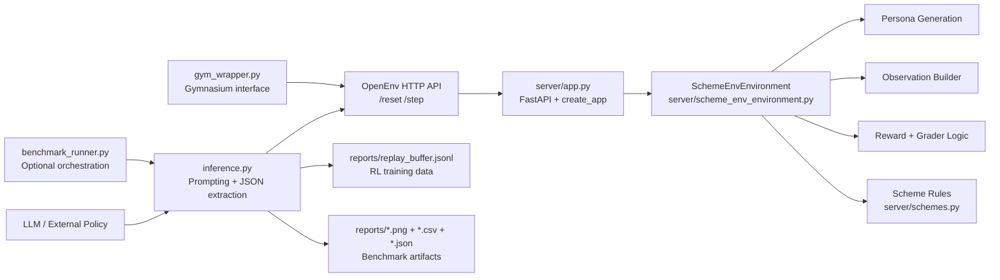
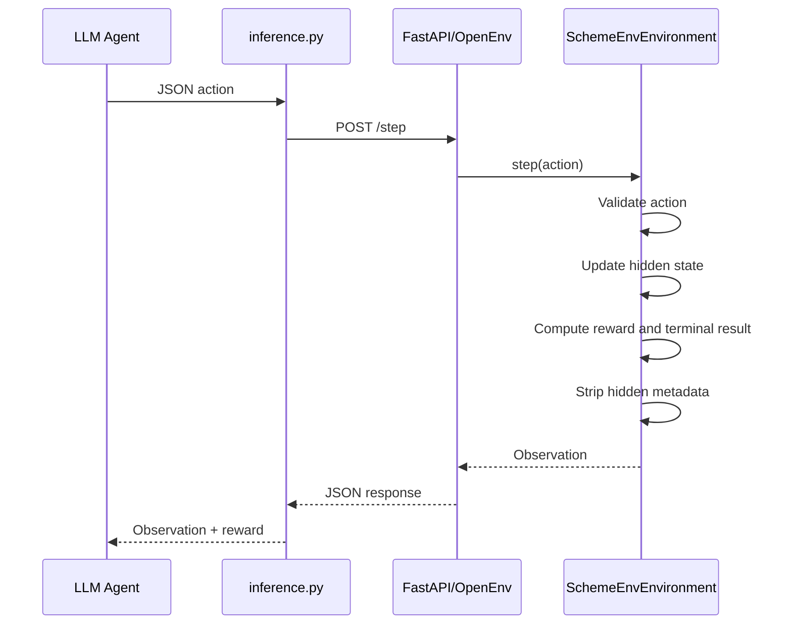

# Indian Government Scheme Enrollment — RL Environment

> *A reinforcement learning benchmark for bureaucratic reasoning: interviewing applicants, verifying documents, applying strict scheme rules, detecting fraud, and knowing when to escalate rather than decide.*

[](https://huggingface.co/spaces/advikdivekar/scheme-enrollment-env)
[](https://github.com/advikdivekar/rl-agent)
[](https://huggingface.co/openenv)
[](tests/)
[](#the-5-tasks)

## The Case Study

Priya is a CSC operator in Barmer, Rajasthan. She interviews dozens of applicants every day across a wooden desk, a government-issue computer, and a slow internet connection. One afternoon, a young man walks in claiming to be a student. He wants to enroll in PMKVY, a skill-training scheme. On the surface, his profile looks plausible.

But something feels wrong. His income is unusually high for a student. Priya asks for his PAN card. It reveals six years of active pension-linked employment from a public sector company. He is not a student. He is attempting to claim a benefit under false pretenses.

Priya does not guess. She does not overreach. She escalates the case.

**This environment trains AI agents to behave like Priya.**

Not just to read a table of rules, but to:

- gather missing information before acting
- verify the right document at the right time
- apply exact arithmetic boundaries
- ignore irrelevant context
- distinguish ineligibility from contradiction
- escalate only when escalation is genuinely required

## Why This Environment Exists

Most RL and agent benchmarks focus on coding, games, search, or generic dialogue. Very few test policy compliance under partial observability, exact thresholds, and procedural safety.

This environment exists to measure a harder and more realistic capability cluster:

- **Policy compliance under uncertainty**: the agent must collect evidence before deciding
- **Fraud detection through document verification**: contradictions emerge only after the correct document is requested
- **Boundary arithmetic**: `9999` qualifies, `10000` does not
- **Escalation protocol**: the agent must know when not to decide
- **Noise filtering**: irrelevant profile fields appear alongside real signal

The benchmark is grounded in a workflow that affects welfare access, fraud prevention, and administrative fairness across rural India.

## Hackathon Compliance Snapshot

| Requirement | Status |
|---|---|
| Real-world task simulation | Yes — Indian CSC welfare officer workflow |
| Full OpenEnv spec: typed models, step/reset/state, openenv.yaml | Yes |
| 5 graded tasks with deterministic scoring in (0, 1) | Yes |
| Meaningful reward shaping over the full trajectory | Yes |
| Root-level inference.py using OpenAI client | Yes |
| Dockerfile + HuggingFace Space deployment | Yes |
| README with environment description, action/observation spaces, setup, baseline | Yes |

## Table of Contents

- [Environment at a Glance](#environment-at-a-glance)
- [Repository Structure](#repository-structure)
- [System Architecture](#system-architecture)
- [Environment Contract](#environment-contract)
- [Action Space](#action-space)
- [Observation Space](#observation-space)
- [Scheme Eligibility Rules](#scheme-eligibility-rules)
- [The 5 Tasks](#the-5-tasks)
- [The Distraction Trap](#the-distraction-trap)
- [Reward Architecture](#reward-architecture)
- [RL Training](#rl-training)
- [Baseline Results](#baseline-results)
- [Setup and Running](#setup-and-running)
- [Multi-Provider Support](#multi-provider-support)
- [Environment Variables](#environment-variables)
- [Testing](#testing)
- [Pre-Submission Validation](#pre-submission-validation)
- [OpenEnv Compliance](#openenv-compliance)

## Environment at a Glance

| Component | Definition |
|---|---|
| **State (S)** | Applicant profile, partial observation state, hidden persona fields, step count |
| **Action (A)** | `ask_question`, `request_document`, `approve_scheme`, `reject_applicant`, `escalate` |
| **Transition (T)** | Deterministic given persona and task template |
| **Reward (R)** | Intermediate shaping plus terminal outcome rewards |
| **Horizon** | 20 steps per episode |
| **Grader** | Terminal normalized score strictly in open interval (0, 1) |
| **Server** | FastAPI via OpenEnv `create_app` |
| **Inference** | OpenAI-compatible client, provider-agnostic |
| **RL Training** | Gymnasium wrapper + JSONL replay buffer included |

## Repository Structure

```text
.
├── README.md
├── pyproject.toml
├── requirements.txt
├── Dockerfile
├── openenv.yaml
├── .env.example
├── models.py
├── inference.py
├── gym_wrapper.py
├── benchmark_runner.py
├── benchmark_report.py
├── server/
│   ├── __init__.py
│   ├── app.py
│   ├── models.py
│   ├── scheme_env_environment.py
│   └── schemes.py
├── tests/
│   ├── conftest.py
│   └── test_scheme_eligibility.py
└── reports/
    ├── average_scores.png
    ├── task_heatmap.png
    ├── difficulty_profile.png
    ├── efficiency_scatter.png
    ├── leaderboard.csv
    ├── results.json
    └── summary.txt
```

### What each file does

- `server/scheme_env_environment.py` — environment lifecycle, task logic, reward shaping, step transitions, shared state, metadata sanitization
- `server/schemes.py` — scheme metadata, eligibility logic, optimal scheme selection
- `models.py` — root `Action` and `Observation` schemas used by inference and server logic
- `inference.py` — single-model evaluation loop, structured logging, replay buffer export
- `gym_wrapper.py` — gymnasium-compatible wrapper for RL training libraries
- `benchmark_runner.py` — optional multi-model orchestration layer
- `benchmark_report.py` — report and chart generation from benchmark artifacts
- `tests/test_scheme_eligibility.py` — 20 boundary-condition and grading tests

## System Architecture



## Environment Contract



## Action Space

The agent sends exactly one JSON action per step:

| Action | Value | Description |
|---|---|---|
| `ask_question` | `age`, `income`, `occupation`, `has_aadhaar` | Request a profile field from the applicant |
| `request_document` | `aadhaar_card`, `pan_card` | Request an official document for verification |
| `approve_scheme` | `PMKVY`, `MGNREGS`, `PMAY` | Enroll the applicant in a welfare scheme |
| `reject_applicant` | `AGE_EXCEEDED`, `INCOME_TOO_HIGH`, `NO_ELIGIBLE_SCHEME`, `MISSING_REQUIRED_DATA`, `DATA_MISMATCH`, `DOCUMENT_CONFLICT` | Reject with a reason category |
| `escalate` | `MANUAL_REVIEW_REQUIRED`, `DATA_MISMATCH` | Hand off to a senior officer |

Example action:
```json
{"action_type": "ask_question", "value": "occupation"}
```

## Observation Space

Each step returns a JSON observation with these fields:

| Field | Type | Description |
|---|---|---|
| `known_profile` | dict | Profile fields collected so far |
| `missing_data` | list | Fields still required before a terminal decision |
| `notification` | string | Environment feedback on the last action |
| `is_terminated` | bool | Whether the episode has ended |
| `grader_score` | float or null | Score in open interval (0, 1) — only set on termination |
| `metadata` | dict | Query counts: `noise_queries`, `redundant_queries`, `relevant_queries` |

Example observation:
```json
{
  "known_profile": {"age": "28", "income": "4500", "occupation": "mason"},
  "missing_data": ["has_aadhaar"],
  "notification": "Applicant confirmed: occupation = mason.",
  "is_terminated": false,
  "grader_score": null,
  "metadata": {"noise_queries": 0, "redundant_queries": 0, "relevant_queries": 1}
}
```

## Scheme Eligibility Rules

All conditions must be simultaneously true. Strict integer arithmetic — no floating-point comparisons.

| Scheme | Age | Occupation | Income | Aadhaar | Benefit |
|---|---|---|---|---|---|
| **PMKVY** | 18–35 | mason or carpenter | ≤ 9,999 | not required | Rs 8,000 stipend |
| **MGNREGS** | 18–60 | farm_labourer only | no ceiling | required | 100 days employment |
| **PMAY** | 21–55 | any | ≤ 5,999 | required | Rs 1.2 lakh grant |

When multiple schemes apply, choose the one with the highest benefit: **PMAY > MGNREGS > PMKVY**.

Critical boundaries:
- `income=9999` qualifies for PMKVY. `income=10000` does not.
- `income=5999` qualifies for PMAY. `income=6000` does not.

## The 5 Tasks

Tasks increase in difficulty from Easy to Expert+. Each resets with a freshly randomized applicant persona so agents cannot memorize fixed trajectories.

### Task 1 — Scheme Discovery (Easy)

Profile is complete but occupation and Aadhaar status are hidden. Agent must collect both fields then apply the benefit-priority hierarchy to choose the optimal scheme. Tests whether the agent prefers PMAY over PMKVY when both are eligible.

### Task 2 — Missing Data (Medium)

Two eligibility-critical fields are withheld in randomized order. Agent must request both before making any terminal decision. Tests sequential information gathering under incomplete state.

### Task 3 — Boundary Fraud Detection (Hard)

Income is hidden at episode start. When collected, it always exceeds the PMKVY ceiling by 1–2000 Rs. Agent must apply exact integer arithmetic and reject, not approve. Tests numeric boundary reasoning without hints.

### Task 4 — Escalation Dilemma (Expert)

Applicant claims to be a student but has suspiciously high income. PAN card reveals six years of active public sector employment — a direct contradiction. Correct resolution: request PAN card, then escalate. Approval or rejection after seeing the contradiction is a protocol violation.

### Task 5 — Document Conflict (Expert+)

Applicant self-reports an age at or near the PMKVY boundary (33–35). Aadhaar always reveals a true age above 35. Agent must request Aadhaar verification before approving or rejecting, then use the verified age as authoritative. Tests document-first reasoning under boundary pressure.

## The Distraction Trap

Every profile contains 1–3 irrelevant noise fields injected at episode start:

```
marital_status, state_of_residence, number_of_children, bank_name
```

Agents that query these fields receive a penalty and a notification that the field is irrelevant. This tests contextual filtering — a real CSC operator skill. The grader penalizes noise queries by −0.08 each, so a sloppy agent that asks about `marital_status` before approving will score lower than one that focuses only on eligibility-relevant fields.

## Reward Architecture

Rewards are shaped across the full trajectory, not just at termination:

| Event | Reward |
|---|---|
| Correct terminal action | +5.0 to +10.0 |
| Soft-block penalty (recoverable) | −1.0 to −1.5 |
| Wrong terminal action | −2.0 to −5.0 |
| Timeout (20 steps) | −2.0 |
| Noise query | −0.10 |
| Redundant query | −0.10 |
| Valid information gathering | 0.0 |

### Grader Score

The grader converts a terminal outcome into a continuous score strictly in the open interval (0, 1):

```
score = clamp(base_score − noise_penalty − redundant_penalty − step_waste + doc_bonus, 0.301, 0.989)
```

- `noise_queries` → −0.08 each
- `redundant_queries` → −0.05 each
- `wasted_steps` → −0.04 each (Task 2 only)
- `document_verified` → +0.05 bonus (Tasks 4 and 5)
- Floor: 0.301 — correct but sloppy agents always outscore wrong ones
- Ceiling: 0.989 — platform requires scores strictly below 1.0

## RL Training

This environment is a complete RL training setup, not just an evaluation benchmark.

**Gymnasium wrapper** (`gym_wrapper.py`) wraps the HTTP server as a standard `gymnasium.Env` so PPO, DQN, or GRPO training loops can plug in directly without any server changes:

```python
from gym_wrapper import SchemeEnvGym

env = SchemeEnvGym(task=1)
obs, info = env.reset()
obs, reward, terminated, truncated, info = env.step_with_action("ask_question", "occupation")
```

**Replay buffer** — every inference run saves all episode transitions to `reports/replay_buffer.jsonl` in standard `(state, action, reward, next_state, done)` format:

```json
{"state": {...}, "action": {"action_type": "ask_question", "value": "occupation"}, "reward": 0.0, "next_state": {...}, "done": false, "task": 1, "model": "Qwen/Qwen2.5-7B-Instruct"}
```

This file is directly compatible with GRPO fine-tuning and DPO preference pairs. The grader score serves as the reward signal. Correct episode trajectories can be paired with incorrect ones to create preference datasets.

## Baseline Results

Tested across 8 models on NVIDIA NIM (N=3 repeats per task):

| Model | T1 | T2 | T3 | T4 | T5 | Avg |
|---|---|---|---|---|---|---|
| mistralai/mistral-nemotron (~56B) | 0.833 | 1.000 | 1.000 | 1.000 | 1.000 | **0.967** |
| nvidia/llama-3.3-nemotron-super-49b-v1 | 0.800 | 0.973 | 1.000 | 1.000 | 1.000 | **0.955** |
| nvidia/llama-3.1-nemotron-51b-instruct | 0.800 | 0.957 | 1.000 | 1.000 | 1.000 | **0.951** |
| nvidia/nemotron-3-nano-30b-a3b | 1.000 | 0.000 | 1.000 | 1.000 | 1.000 | 0.800 |
| nvidia/nemotron-3-super-120b-a12b | 1.000 | 0.000 | 1.000 | 1.000 | 1.000 | 0.800 |
| nvidia/nemotron-mini-4b-instruct | 0.483 | 0.667 | 0.667 | 0.967 | 0.000 | 0.557 |
| meta/llama-3.1-8b-instruct | 0.400 | 0.000 | 0.317 | 0.867 | 1.000 | 0.517 |
| nvidia/llama-3.1-nemotron-nano-8b-v1 | 0.283 | 0.303 | 0.000 | 0.333 | 0.000 | 0.184 |

Full charts in `reports/`:

| Chart | Description |
|---|---|
| `average_scores.png` | All 8 models ranked by average score |
| `task_heatmap.png` | Per-task score grid — red = 0.0, green = 1.0 |
| `difficulty_profile.png` | Mean score per task across all models |
| `efficiency_scatter.png` | Average score vs Task 4 escalation protocol score |

### What the results reveal

Task 1 consistently separates models — choosing PMAY over PMKVY when both are eligible requires understanding benefit priority, not just eligibility rules. Task 2 is the sharpest discriminator: several large models score 0.000 because they approve without waiting for all missing fields to be collected. Task 4 is protocol-heavy: once the PAN card contradiction is document-backed, most models above 30B resolve it correctly. Task 5 separates small models sharply — understanding the age conflict and translating it into the correct sequence (request Aadhaar → reject) requires multi-step conditional reasoning.

## Setup and Running

### Option 1 — Docker (recommended)

```bash
docker build -t scheme-enrollment-env .
docker run -p 7860:7860 scheme-enrollment-env
curl http://localhost:7860/health
```

### Option 2 — Local

```bash
git clone https://github.com/advikdivekar/rl-agent.git
cd rl-agent
python -m venv .venv
source .venv/bin/activate
pip install -r requirements.txt
export PYTHONPATH=.
uvicorn server.app:app --host 0.0.0.0 --port 7860
```

### Verify the server is running

```bash
curl http://localhost:7860/health
# {"status": "ok"}

curl -X POST http://localhost:7860/reset \
  -H "Content-Type: application/json" \
  -d '{"seed": 1}'
# Returns observation with known_profile, missing_data, notification
```

### Running inference

```bash
export HF_TOKEN=your_token
export API_BASE_URL=https://router.huggingface.co/v1
export MODEL_NAME=Qwen/Qwen2.5-7B-Instruct
export ENV_URL=http://localhost:7860
export N_REPEATS=3
python inference.py
```

## Multi-Provider Support

The inference script works with any provider that supports the OpenAI `/v1/chat/completions` format. Only two variables change per provider:

| Provider | API_BASE_URL | Get key at |
|---|---|---|
| HuggingFace | `https://router.huggingface.co/v1` | huggingface.co/settings/tokens |
| OpenRouter | `https://openrouter.ai/api/v1` | openrouter.ai/settings/keys |
| NVIDIA NIM | `https://integrate.api.nvidia.com/v1` | build.nvidia.com |
| OpenAI | `https://api.openai.com/v1` | platform.openai.com/api-keys |
| Groq | `https://api.groq.com/openai/v1` | console.groq.com/keys |
| Together AI | `https://api.together.xyz/v1` | api.together.xyz/settings/api-keys |

Copy `.env.example` to `.env` and fill in your key:

```bash
cp .env.example .env
# Edit .env with your provider and key
python inference.py
```

## Environment Variables

| Variable | Default | Description |
|---|---|---|
| `HF_TOKEN` | unset | API key — works for all providers |
| `API_BASE_URL` | `https://router.huggingface.co/v1` | Provider endpoint |
| `MODEL_NAME` | `Qwen/Qwen2.5-7B-Instruct` | Model identifier |
| `LOCAL_IMAGE_NAME` | unset | Optional — for from_docker_image() workflows |
| `ENV_URL` | `http://localhost:7860` | Environment server URL |
| `N_REPEATS` | `3` | Episodes per task for score averaging |
| `INFERENCE_TEMPERATURE` | `0.0` | Sampling temperature — 0.0 for determinism |
| `MAX_TOKENS` | `1500` | Max tokens per model call |
| `REPLAY_BUFFER_PATH` | `reports/replay_buffer.jsonl` | Where episode transitions are saved |

## Testing

```bash
export PYTHONPATH=.
pytest tests/ -v
```

20 tests covering:

- PMKVY age and income boundary conditions (age=35 qualifies, age=36 does not)
- PMAY strict income ceiling (income=5999 qualifies, income=6000 does not)
- MGNREGS Aadhaar requirement
- Optimal scheme priority ordering (PMAY > MGNREGS > PMKVY)
- Grader score floor (0.301), ceiling (0.989), and penalty arithmetic

## Pre-Submission Validation

```bash
./validate-submission.sh https://advikdivekar-scheme-enrollment-env.hf.space .
```

Checks: repo structure, inference contract, OpenEnv spec, README content, HF Space liveness, Docker build, openenv validate, Python compile, pytest.

Expected output:
```
========================================
  Validation checks passed: 35
  Submission looks ready for hackathon review.
========================================
```

## OpenEnv Compliance

| Requirement | Status |
|---|---|
| `step()` / `reset()` / `state` property | Yes |
| Typed `Action` model with strict validation | Yes |
| Typed `Observation` model | Yes |
| `openenv.yaml` with spec_version, runtime, app, port, resources | Yes |
| `/health` endpoint | Yes |
| OpenAI-compatible inference client | Yes |
| Root `inference.py` | Yes |
| `API_BASE_URL`, `MODEL_NAME`, `HF_TOKEN`, `LOCAL_IMAGE_NAME` in inference.py | Yes |
| Structured `[START]` / `[STEP]` / `[END]` stdout logs | Yes |
| `SCORE_JSON` and `STD_JSON` output lines | Yes |
| 5 graded tasks with deterministic scoring | Yes |
| Grader scores strictly in open interval (0, 1) | Yes |
| Gymnasium wrapper for RL training | Yes |
| Replay buffer export in JSONL format | Yes |
| FastAPI runtime on port 7860 | Yes |
| Resource declaration: 2 vCPU, 8GB RAM | Yes |

## Closing Note

This benchmark is strongest when understood as a test of **operational judgment**, not just reasoning accuracy. The agent must be precise, skeptical, protocol-aware, and restrained. That combination is rare in benchmarks and crucial in real administration systems.

If an AI system can perform well here, it is not merely answering questions. It is behaving like a careful officer.